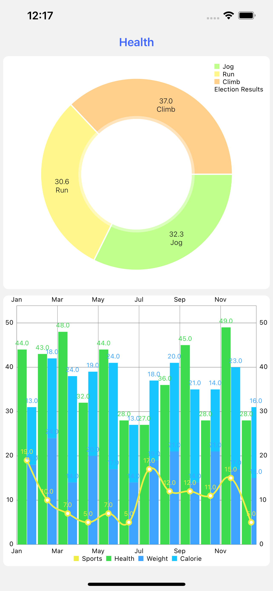
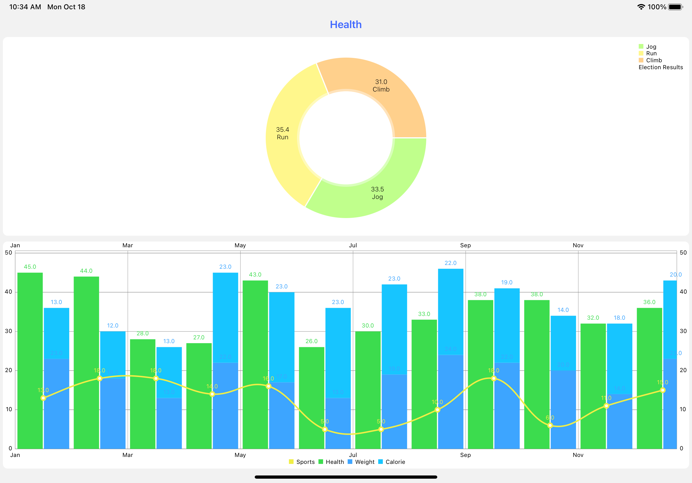

# HealthSample

#### First run pod install, then build the project and run in your devices or simulators.
#### This project has used RIBs, Swift, RxSwift, Anchorage, Charts.
#### The sample app has adapted different kinds of iPhone & iPad devices. And it supports rotation for iPads.
#### GUI
+ iPhone 

+ iPad
